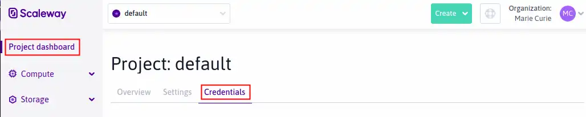
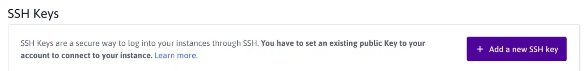

<div id="top"></div>

<!-- PROJECT LOGO -->
<br />
<div align="center">
  <a href="https://github.com/github_username/repo_name">
    
  </a>
<h3 align="center">Mise en place d'une solution Cloud</h3>
</div>

<!-- TABLE OF CONTENTS -->
<details>
  <summary>Table of Contents</summary>
  <ol>
    <li>
      <a href="#about-the-project">About The Project</a>
      <ul>
        <li><a href="#built-with">Built With</a></li>
      </ul>
    </li>
    <li>
      <a href="#getting-started">Getting Started</a>
      <ul>
        <li><a href="#prerequisites">Prerequisites</a></li>
        <li><a href="#installation">Installation</a></li>
      </ul>
    </li>
    <li><a href="#usage">Usage</a></li>
    <li><a href="#contributing">Contributing</a></li>
    <li><a href="#contact">Contact</a></li>
  </ol>
</details>

<!-- ABOUT THE PROJECT -->
## About The Project

The objective of this tutorial is to experiment with the deployment of a cloud solution in a cloud platform. Unlike the previous lab, this one can be done in groups of 2 or 3. The objective of this tutorial is not to evaluate your ability to deploy a solution, but rather your ability to optimize and automate its deployment.

<p align="right">(<a href="#top">back to top</a>)</p>

### Built With

* [Terraform](https://www.terraform.io/cli/commands/plan)

<p align="right">(<a href="#top">back to top</a>)</p>

<!-- GETTING STARTED -->
## Getting started with Terraform and Scaleway

Tutorial on how to get started with Terraform and Scaleway.
The provision of Scaleway credentials will be done with the SCW CLI. This will avoid any credential leaks

# Prerequisites
## Installing Terraform
The Terraform documentation is more suitable because the installation method depends strongly on your environment
environment Documentation

### CLI Scaleway
#### Installation de CLI Scaleway


```sudo curl -o /usr/local/bin/scw -L "https://github.com/scaleway/scaleway-cli/releases/download/v2.4.0/scw-2.4.0-linux-x86_64" ```
  
  ```sudo chmod +x /usr/local/bin/scw ```
  
### Prerequisites
#### generate an SSH key

SSH keys allow you to securely connect to your Instances without using a password. An SSH key consists of an RSA key pair, which has two elements:

An identification key (also known as private key), which you must keep securely on the computer you want to connect from.
A public key which you must upload to the Scaleway interface. This is then transferred to your Instance during the boot process.
You can generate the SSH key pair on your local machine. The process will depend on your operating system.

This is an example of how to list things you need to use the software and how to install them.
## Requirements:
You have an account and are logged into the Scaleway Console

Type ```ssh-keygen -o -b 4096``` and press Enter to generate a new key.

Important: For security reasons you must generate a 2048-bit or 4096-bit RSA key (hence the -b 4096 part of the command). Older 1024-bit keys are no longer supported. The -o option was added in 2014, to specify use of the new OpenSSH format. If the command fails for you, try removing the -o.

Enter a filepath to save the key to when prompted. Alternatively, press Enter to leave this at the default setting (the key will be saved in a file called id_rsa in the /Users/me/.ssh directory).

```Enter file in which to save the key (/Users/me/.ssh/id_rsa):```

Enter a passphrase when prompted. This step is not mandatory, but is recommended for increased security. The passphrase can be freely chosen. If you do not want to set a passphrase, press Enter directly.

```Enter passphrase (empty for no passphrase):```

Enter the passphrase again for confirmation when prompted, and press Enter:
```Enter same passphrase again:```

The key pair is generated in the filepath you specified. The key pair consists of:

The public key, named ```id\_rsa.pub```
The private (identification) key, named ```id\_rsa```
Display the content of the public key with the following command and copy it.
```cat /Users/me/.ssh/id_rsa.pub```

Copy the content of the public key which is displayed. You will need this in the next step. Your key should look something like the output shown:
```ssh-rsa AAAAB3NzaC1yc2EAAAADAQABAAACAQC/tcOt7Lwx5MEPyHo+pcK/XYi7ZvZi4OzLZd59E2MyTLg5```
## How to upload the public SSH key to the Scaleway interface
You must upload the content of the public part of the SSH key pair you just generated to the Scaleway interface. This is then transferred to your Instance during the boot process. You can then connect and authenticate from your local machine (where the private key is) to the remote Instance (where the public key is).

* Log into the Scaleway console, and navigate to the Credentials tab of your Project Dashboard:
<a href="https://www.scaleway.com/en/docs/console/my-project/how-to/create-ssh-key/">
    
</a>

* Scroll down to the SSH Key section, and click Add a new SSH key.
<a href="https://www.scaleway.com/en/docs/console/my-project/how-to/create-ssh-key/">
    
</a>

Paste the content of the public key (which you copied in the previous step) into the pop-up box, and optionally add a description. Then click Add a SSH key.
You will now be able to connect to your Instances via SSH
If problem when redeploying new instance : 

 ```ssh-keygen -f "/home/$user$/.ssh/known_hosts" -R "Ip_Public"```

 ```ssh -i ~/.ssh/id_rsa root@51.15.209.133```
 
## Configuration de la CLI SCW

```scw init```

```Enter a valid secret-key or an email: <votre_mail>
Enter your password: <votre mot de passe il ne s'affichera pas c'est normal>
To improve this tool we rely on diagnostic and usage data.
Sending such data is optional and can be disabled at any time by running "scw config set send-telemetry=false".
Do you want to send usage statistics and diagnostics? (Y/n): y
To fully enjoy Scaleway CLI we recommend you install autocomplete support in your shell.
Do you want to install autocomplete? (Y/n): y
Creating new config at /home/bbalaud/.config/scw/config.yaml
Config saved at /home/bbalaud/.config/scw/config.yaml:
access_key: SCWA7Z3HSQ5T46GT9E0V
secret_key: 26acf066-xxxx-xxxx-xxxx-xxxxxxxxxxxx
default_organization_id: 47fd9bd7-e93b-40e9-98fe-3691351fa3f4
default_project_id: 47fd9bd7-e93b-40e9-98fe-3691351fa3f4
default_region: fr-par
default_zone: fr-par-1
To enable autocomplete, scw needs to update your shell configuration.
What type of shell are you using (default: bash):
To enable autocomplete we need to append to ~/.bashrc the following lines:
# Scaleway CLI autocomplete initialization.
eval "$(scw autocomplete script shell=bash)"
Do you want to proceed with these changes? (Y/n): y
[V] Initialization completed with success.
Except for SSH key: could not find an SSH key at ~/.ssh/id_rsa.pub
```
# First Terraform

Based on scw-cli README.md
Creating the directory to store the Terraform project

```mkdir myproject```

```cd myproject```

Creating the first Terraform file. Terraform files must necessarily end with the .tf extension.

```nano main.tf```
### Example : 
```
terraform {
required_providers {
scaleway = {
source = "scaleway/scaleway"
}
}
required_version = ">= 0.13"
}
provider "scaleway" {
zone = "fr-par-1"
region = "fr-par"
}
resource "scaleway_instance_ip" "public_ip" {
}
resource "scaleway_instance_server" "web" {
type = "DEV1-S"
image = "ubuntu_focal"
tags = ["front", "web"]
ip_id = scaleway_instance_ip.public_ip.id
root_volume {}
}
```
Terraform Initialization, Planning and Implementation.
```terraform init```
```terraform plan```
```terraform apply```
Once your tests are completed you can destroy the resources with :
```terraform destroy```

## How to contribute
Just send a pull-request :trophy:

## Authors
:cocktail: <b>Kilian Le Roux</b> - <i>Developper | Sysadmin</i>. </br>
:cocktail: <b>Etienne Drapp</b> - <i>Developper | Sysadmin</i>. </br>

## Sources
:gem: Terraform Install : https://nextgentips.com/2021/11/20/how-to-install-terraform-on-debian-11/ </br>
